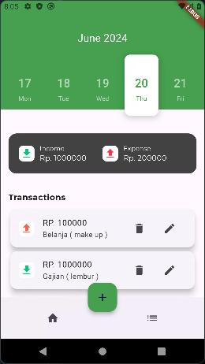
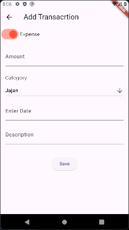
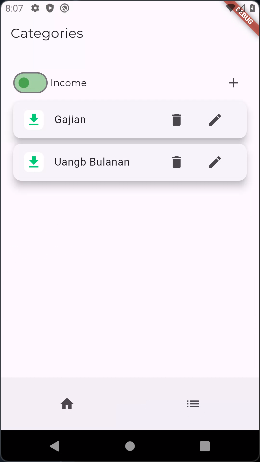
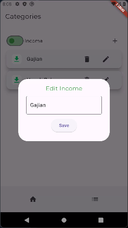
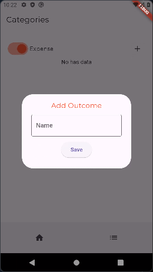

# SiAbank

siAbank adalah aplikasi android yang dirancang untuk membantu pengguna mengelola keuangan pribadi mereka dengan mudah dan efektif.

## Features
- **Melihat Pemasukan dan Pengeluaran**: Users bisa melihat Pemasukan dan Pengeluaran yang telah tercatat.
- **Membuat Pencatatan Transaksi Keuangan**: Users dapat menambahkan catatan keuangan mereka.
- **Edit Pencatatan Transaksi**: Users bisa mengedit catatan keuangan mereka yang sudah ada sebelumnya.
- **Hapus Pencatatan Transaksi**: Users bisa menghapus catatan keuangan yang tidak dibutuhkan lagi.
- **CRUD Kategori**: Users bisa CRUD kategori.

## App Development
- **Fitur Merekap Jumlah Pemasukan dan Pengeluaran**: Sekarang aplikasi sudah bisa merekap Pemasukan dan Pengeluaran.
- **Perbaikan Bug**: Mengurangi Bug yang ada.

## Technologies Used

### Frontend
- **Dart**: The main programming language used for developing this application.
- **Flutter**: A framework for building responsive and attractive user interfaces.

### Dependencies
- **sqflite**: Sebuah plugin untuk mengakses dan mengelola database SQLite lokal di aplikasi Flutter. Berguna untuk menyimpan data secara persisten di perangkat pengguna.
- **path_provider**: Membantu menemukan direktori umum di sistem file perangkat, seperti direktori dokumen atau direktori penyimpanan sementara. Berguna untuk menyimpan file secara lokal.
- **initl**: Menyediakan alat untuk memformat tanggal, angka, dan pesan sesuai dengan lokalisasi (bahasa dan wilayah) pengguna. Memastikan aplikasi dapat digunakan oleh pengguna dari berbagai budaya.
- **cupertino_icons**:  Kumpulan ikon bergaya iOS yang dapat digunakan dalam aplikasi Flutter. Memberikan tampilan dan nuansa iOS pada aplikasi.
- **drift**: menyediakan cara yang lebih mudah dan aman untuk berinteraksi dengan database SQLite. Menyederhanakan operasi database dan meningkatkan keamanan data
- **sqlite3_flutter_libs**: menjalankan sqflite di platform tertentu. Biasanya digunakan secara otomatis oleh sqflite
- **path**: Paket inti Dart yang menyediakan utilitas untuk bekerja dengan jalur file dan direktori. Berguna untuk memanipulasi jalur file dalam aplikasi
- **calendar_appbar**: Widget AppBar khusus yang menampilkan kalender dan memungkinkan pengguna untuk memilih tanggal. Berguna untuk aplikasi yang memerlukan pemilihan tanggal
- **google_fonts**: untuk dengan mudah menggunakan berbagai font Google dalam aplikasi Flutter Anda. Meningkatkan tampilan dan nuansa aplikasi
- **flutter_lints**: menganalisis kode Flutter Anda dan mengidentifikasi potensi masalah. Membantu Anda menulis kode yang lebih bersih dan lebih efisie
- **drift_dev**:  untuk digunakan dengan paket drift. Menyediakan fitur seperti pembuatan kode otomatis dan migrasi database.
- **build_runner**: untuk menghasilkan kode secara otomatis dalam proyek Flutter Anda. Digunakan oleh berbagai paket, termasuk drift, untuk menghasilkan kode boilerplate.

## Project Thumbnail 

    
    &nbsp;&nbsp;
    
    &nbsp;&nbsp;
    
    &nbsp;&nbsp;
    
    &nbsp;&nbsp;
    
    &nbsp;&nbsp;
    

